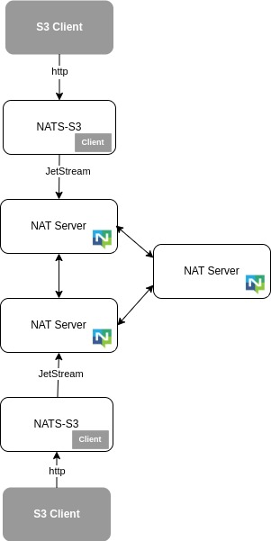

# NATS
NATS is a high performance distributed system including at its core a Publish/Subscribe system 
and a built-in persistent system that enables Streaming, Key-Value Store and Object Store.
It is a complete system with built-in authentication/authorization, and multi-tenancy models, with various other features.


## NATS-S3
Most of the modern Object Storage systems such as [MinIO](https://github.com/minio/minio), 
[SeaweedFS](https://github.com/seaweedfs/seaweedfs), [JuiceFS](https://github.com/juicedata/juicefs), 
[AIStore](https://github.com/NVIDIA/aistore), etc supports S3 API 
which simplifies the integration over HTTP.
We take the same approach here with NATS-S3 enabling access to NATS Object Store over S3 protocol.



## Usage
Once NATS-S3 is running connected to NATS servers, NATS Object Store can be access over
S3 API. The following shows how NATS Object Store is accessible over AWS CLI.

#### List NATS Buckets
```shell
$ aws s3 ls  --endpoint-url=http://localhost:5222
```

#### List content of NATS Bucket, bucket1
```shell
$ aws s3 ls s3://bucket1 --endpoint-url=http://localhost:5222
```

#### List content of NATS Bucket, bucket1
```shell
$ aws s3 ls s3://bucket1 --endpoint-url=http://localhost:5222
```

#### Upload an object to a NATS bucket
```shell
$ aws s3 cp file1.txt s3://bucket1 --endpoint-url=http://localhost:5222
```

#### Download an object from a NATS bucket
```shell
$ aws s3 cp s3://bucket1/file1.txt file1_copy.txt --endpoint-url=http://localhost:5222
```